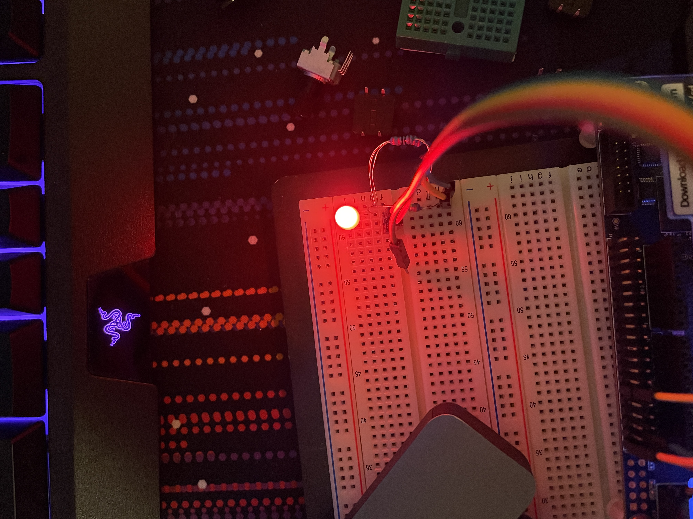
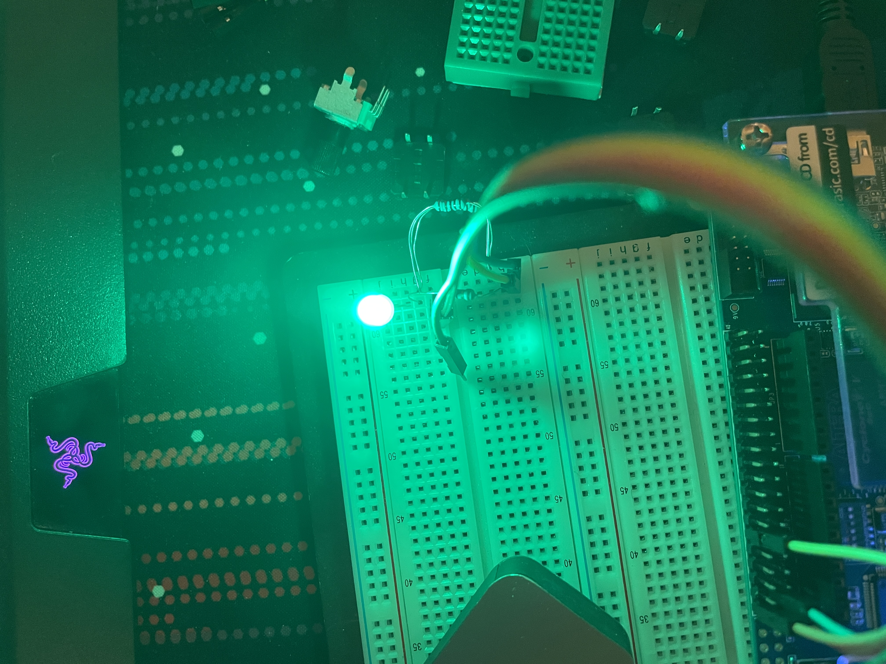

# Homework 10 RGB LED Controller VHDL
## Overview
In this Homework, I created a avalon bus platform to interact with three instantiations of my pwm controller in order to drive an RGB LED
## Deliverables
### Red colored LED

### Green colored LED

### Blue colored LED

### Custom Color LED (Pink)

### Writing custom duty cycle and period for the pwms controlling rgb led

## 
### Equation for calculating resistance values for Red, Green, and Blue LEDs
$$R = (V_s - V_f)/I_m$$  
Where:  
$V_s$ is the supply voltage: 3.3V  
$V_f$ is the forward voltage for the led (red, green, and blue have 2.1V, 3.1V, and 3.1V respectivly)  
$I_m$ is the maximum current through the led  