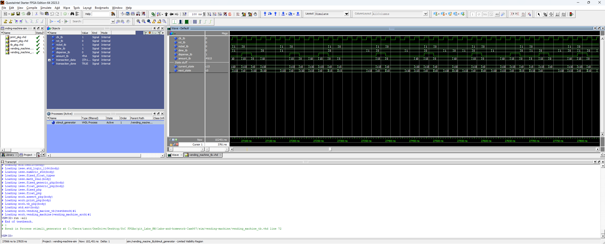

# Homework 5 Vending Machine VHDL

## Overview
In this homework, I practiced creating FSMs, enumerated state types, sensitivity lists, and synchronous vs. asynchronous logic  
Im not sure the testbench worked for me because it didn't give me any failures even when I purposfully made the machine fail  
I inspected the waveform though and I think that my final design works as described.

## Deliverables

