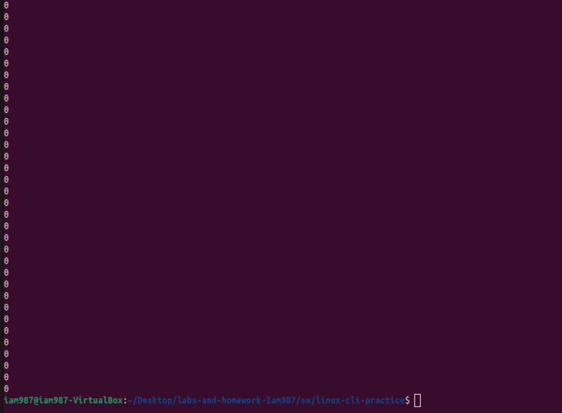

# Homework 7 Linux CLI Practice
## Overview
In this Homework, I learned how to use some helpful commands in the linux terminal
## Deliverables
### 1: Command: `wc lorem-ipsum.txt -w`
Screenshot: 

### 2: Command: `wc lorem-ipsum.txt -m`
Screenshot: 

### 3: Command: `wc lorem-ipsum.txt -l`
Screenshot: 

### 4: Command: `sort -h file-sizes.txt`
Screenshot: 

### 5: Command: `sort -h -r file-sizes.txt`
Screenshot: 

### 6: Command: `cut -d, -f3 log.csv`
Screenshot: 

### 7: Command: `cut -d, -f2,3 log.csv`
Screenshot: 

### 8: Command: `cut -d, -f1,4 log.csv`
Screenshot: 

### 9: Command: `head -n 3 gibberish.txt`
Screenshot: 

### 10: Command: `tail -n 2 gibberish.txt`
Screenshot: 

### 11: Command: `tail -n +2 log.csv`
Screenshot: 

### 12: Command: `grep "and" gibberish.txt`
Screenshot: 

### 13: Command: `grep -w -n we gibberish.txt`
Screenshot: 

### 14: Command: `grep -o -P "to \w+" gibberish.txt`
Screenshot: 

### 15: Command: `grep -c FPGAs fpgas.txt`
Screenshot: 

### 16: Command: `grep -P "FPGAs are .ot|ower|ile"  fpgas.txt` 
Screenshot: 

### 17: Command: `grep -c -P "^\s*\-\-" ../../hdl/*/*`
Screenshot: 

### 18: Command: `ls > ls-output.txt; cat ls-output.txt`
Screenshot: 

### 19: Command: `sudo dmesg | grep "CPU topo"`
Screenshot: 
  
Note: There were no "CPU topo" instances in the output
### 20: Command: `find ../../hdl/*/* -iname '*vhd' | grep -c "vhd"`
Screenshot: 

### 21: Command: `grep "\-\-" ../../hdl/*/* | grep -c "\-\-"`
Screenshot: 

### 22: Command: `grep -n "FPGAs" fpgas.txt | cut -d: -f1`
Screenshot: 

### 23: Command: `du -h * | sort -h -r | head -n 3`
Screenshot: 

