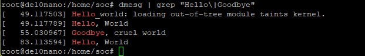
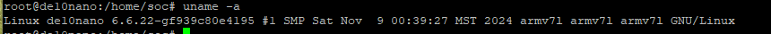

# Homework 8 "Hello World" Linux Kernel Module
## Overview
In this Homework, I Learned how to create linux modules and cross compile them for the fpga
## Deliverables
### 
Screenshot: Hello world in ubuntu machine

### 
Screenshot: modinfo in ubuntu machine

### 
Screenshot: uname in ubuntu machine

### 
Screenshot: Hello world in soc

### 
Screenshot: modinfo in soc

### 
Screenshot: uname in soc

