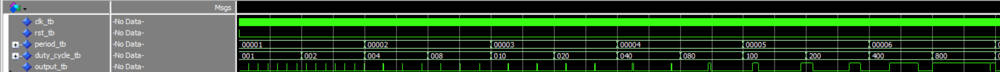
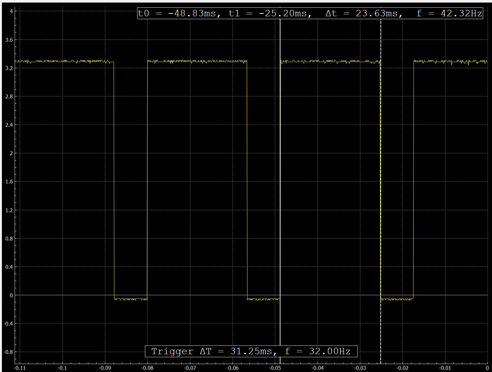

# Homework 7 Linux CLI Practice
## Overview
In this Homework, I created vhdl to control the ouput of a gpio pin with pwm.
## Deliverables
### Simulated PWM

### Oscilloscope output PWM @ period = 32ms, duty cycle = 75% 
