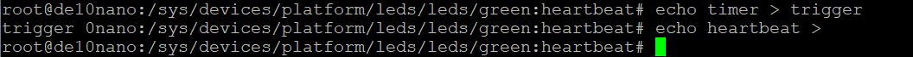

##
# Lab 10 - Device Trees
## Overview
In this Lab, I modified files in the dts directory 
## Deliverables
### Screenshot of changing trigger sources

### Questions
>What is the purpose of a device tree?  

A device tree lets us use previously defined device architecture so that the OS doesn't need to have manually defined properties for each device connected to it.