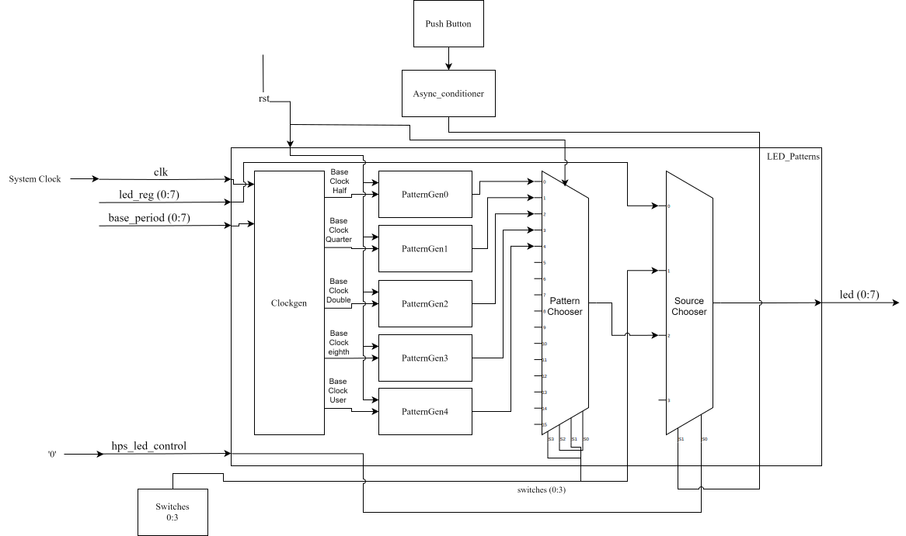

##
# Lab 4 - LED Patterns
## Overview
This project included VHDL files that defined functionality for clock generators, pattern generators, a pattern chooser state machine.  

The basic requirements for this project state that LED7 always blinks at the base rate that I defined, the rest of the LEDs would follow one of 6 different patterns dependent on the switches' and the push button's states, the last requirement is that the push button input must have a conditioned signal (this functionality was created in hw4).  

The different patterns are:  
0: Right shifting (1 LED) @ 1/2 base rate  
1: Left shifting (2 LEDs) @ 1/4 base rate  
2: 7-Bit up counter  
3: 7-Bit down counter  
4: User defined pattern: bank of 7 LEDs shifting back and fourth  
5: delay/waiting state to show the status of the input LEDs for 1 second
## System Architecture:
### System Block Diagram: 

The system has 4 major sections to pay attention to: the inputs/outputs, clockgen, patterngen, and choosers.  
Some of the inputs like `led_reg` and `hps_led_control` aren't utilized very much in this lab, those are included so that in future projects this code will implement smoother.  
The only outputs are the LEDs, this system drives them with the requirements stated in [Overview] in mind.  
The clockgen component is just multiple clock generators that will output the necessary clocks for each respective pattern generator as well as the base clock for LED7.  
The patterngen components simply output the described patterns with clock signals from clockgen.
The choosers are essentially fancy multiplexers, they take in multiple inputs and select lines and output a single pattern.  
### Pattern Chooser State Diagram
  
The pattern chooser just decides what pattern will be outputted dependent on the position of the switches.  
## Implementation Details
To implement my custom pattern, I initially wanted to do a random number/pattern generator. I wasn't able to spend enough time with that idea, so I have the pattern as previously described in [Overview].
This is done by use of a three process state machine. There are 28 possible states (s0 - s27) and each just shifts left or right the set bits depending on the part of the pattern each state resides.
##