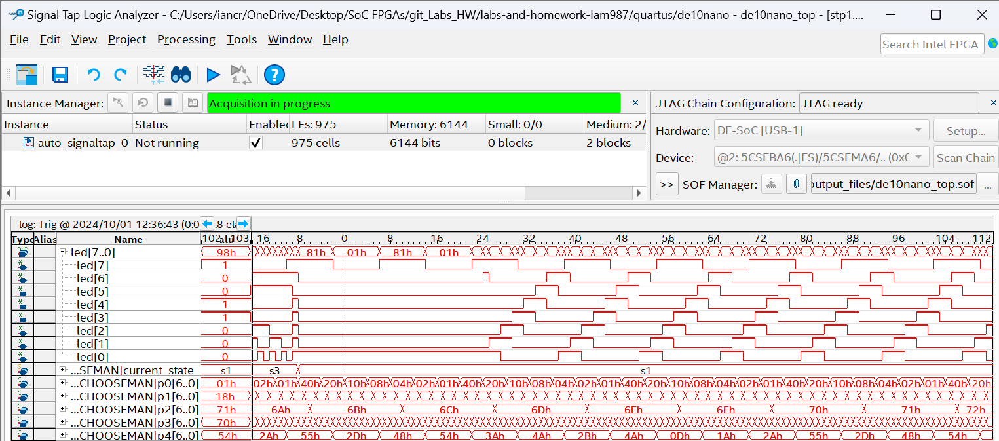
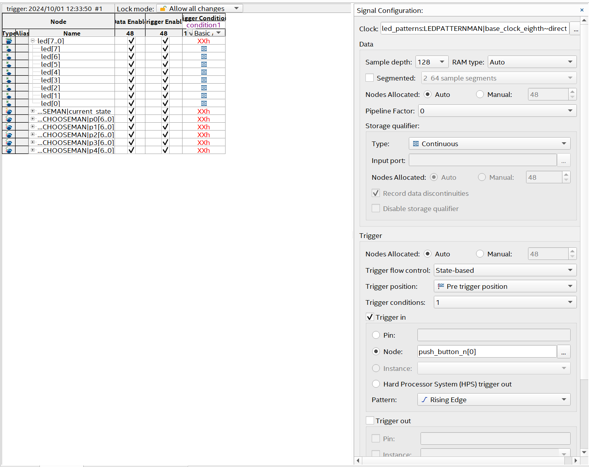
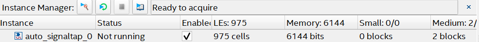

##
# Lab 5 - Signal Tap
## Overview
In this lab I used the logic analyzer tool that Quartus provides to look at the state transitions and outputs of my lab 4 led patterns project
## Deliverables
### Signal Tap Waveform

### Configuration pane showing sample depth
  

##
### Questions
>How Much FPGA on-chip memory was required to monitor your signals?

Answer: 6144 bits as seen in the screenshot below

