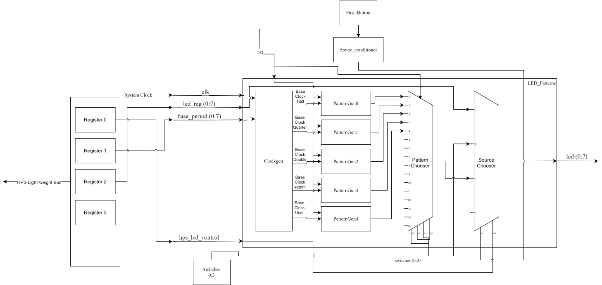

##
# Lab 6 - Creating a Custom Hardware Component in Platform Designer  
## Overview
This project included creating an IP in Platform Designer to stage the previously created LED patterns files for use in parallel with the SoC to be implemented in Lab 7.  
## System Architecture:  
### System block diagram:  
  
The system uses the same components and connections as Labs 4 and 5 but now have a register and bus system to talk with the SoC.
## Register Map:
There are three registers that are necessary for this lab, one to tell the system which pattern generator to use (hps_led_control -> Reg0), one to give the base period to the hardware pattern gens (base_period -> Reg1), and one to give a pattern to the system for when the chosen source is the hps (leg_reg -> Reg2).
### Reg0
  
### Reg1
  
### Reg2
  
### Address map
Addresses are in binary on an address line with a width of 2-bits

|Register|Address|
|--------|-------|
|Reg0|00|
|Reg1|01|
|Reg2|10|

## Platform Designer
### Questions
>How did you connect these registers to the ARM CPUs in the HPS? 

Answer: In platform designer I linked an avalon memory-mapped slave interface to the hps component.
>What is the base address of your component in your Platform Designer system?  

Answer: 0x0000 0000